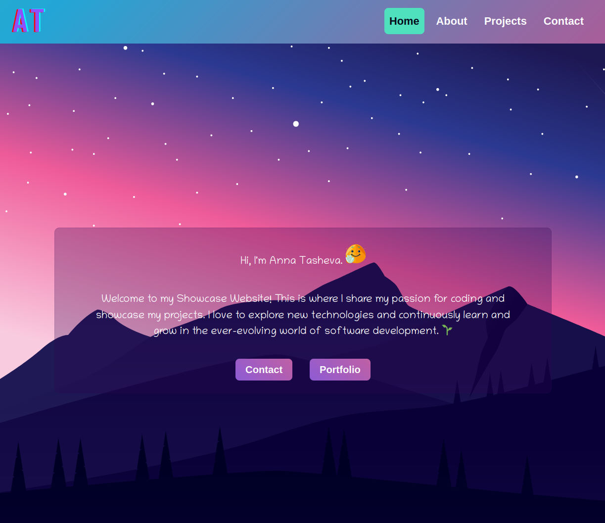

# Show-Case Portfolio Website



## Introduction

Welcome to my Show-Case Portfolio Website, thoughtfully crafted to support my application to Founders and Coders. It offers a brief overview of my journey, motivations, and project work, showcasing my commitment to becoming a proficient web developer. This site is built entirely from scratch, without relying on external libraries such as Bootstrap, React, or Jekyll themes.

## Tech Stack

-   **HTML:** HTML forms the structural backbone of this website, shaping its layout and composition.
-   **CSS:** CSS is wielded to meticulously craft the visual aesthetics, ensuring an engaging user experience.
-   **JavaScript:** JavaScript has been utilized to enhance interactivity, providing users with a seamless and dynamic browsing experience.

## Getting Started

If you wish to explore this website locally:

1. Clone this repository to your local machine:

    ```bash
    git clone https://github.com/AnnaTas77/showcase-website
    ```

2. Navigate to the project directory:

    ```bash
    cd showcase-website
    ```

3. Open `index.html` in your preferred web browser.

## Connect

I am enthusiastic about connecting with fellow web development enthusiasts and potential collaborators. Your support and constructive feedback are invaluable. 🚀
